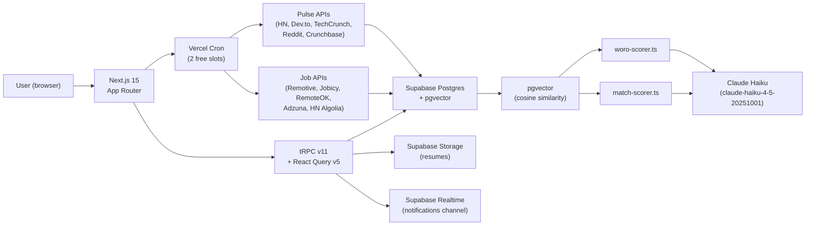

# Worojuro

**Job search intelligence for the focused job seeker.**

*woro* (alert/news) + *juro* (trust/oath) — Yoruba-inspired.
It alerts you to the right jobs and the **Woro score** tells you which ones to trust.

---

## What it does

| Module | Description |
|---|---|
| **Job Tracker** | Kanban pipeline: Saved → Applied → OA → Phone → Interview → Offer → Rejected → Ghosted |
| **Curated Feed** | AI-matched jobs scored 0–100 against your resume. Infinite scroll. One-click save. |
| **Woro Score** | 0–100 trust/legitimacy score on every listing. Red = suspicious, Amber = verify, Green = looks legit |
| **Smart Notifications** | Realtime alerts for new matches, Woro alerts, status reminders |
| **Referral Finder** | Import LinkedIn CSV — see who you know at every company |
| **Market Analysis** | AI switch/wait signal, salary benchmark, best-time-to-apply heatmap |
| **Resume Vault** | Upload PDF/DOCX, auto-parse skills + experience, embed for matching |
| **Market Pulse** | 4-tab intelligence feed: Tech / Layoffs / Market / Funding — refreshed every 6h |

---

## Architecture



---

## Stack

- **Frontend:** Next.js 15 App Router · React 19 · TypeScript strict · Tailwind CSS v4 · shadcn/ui
- **API:** tRPC v11 · React Query v5
- **Auth:** Supabase Auth · @supabase/ssr
- **Database:** Supabase Postgres · Drizzle ORM · pgvector (1536-dim embeddings)
- **Storage:** Supabase Storage (resumes bucket)
- **Realtime:** Supabase Realtime
- **Email:** Resend + React Email
- **AI:** Claude Haiku (`claude-haiku-4-5-20251001`) · OpenAI `text-embedding-3-small`
- **Cron:** Vercel Cron (2 free slots: 6h ingest + 7am digest)
- **Deploy:** Vercel Hobby free tier

**Total monthly cost: $0**

---

## Local setup

### Prerequisites
- Node.js 20+
- [Supabase CLI](https://supabase.com/docs/guides/cli)
- [Vercel CLI](https://vercel.com/docs/cli)

### 1. Clone and install

```bash
git clone <repo>
cd worojuro
npm install
```

### 2. Copy and fill env vars

```bash
cp .env.example .env.local
# Fill in all values — see .env.example for where to get each
```

### 3. Start Supabase locally

```bash
supabase start
# Note the local URL + anon key — update NEXT_PUBLIC_SUPABASE_URL and ANON_KEY in .env.local
```

### 4. Run migrations

```bash
npx drizzle-kit migrate
# Or for local Supabase:
supabase db push
```

### 5. Seed the database (optional)

```bash
# Set SEED_USER_ID to your Supabase auth UID first
npx tsx server/db/seed.ts
```

### 6. Start dev server

```bash
npm run dev
# Open http://localhost:3000
```

---

## Testing crons locally

Both cron routes require `Authorization: Bearer <CRON_SECRET>` header.

```bash
# Set your CRON_SECRET in .env.local first, then:
curl -H "Authorization: Bearer $(grep CRON_SECRET .env.local | cut -d= -f2)" \
  http://localhost:3000/api/cron/ingest

curl -H "Authorization: Bearer $(grep CRON_SECRET .env.local | cut -d= -f2)" \
  http://localhost:3000/api/cron/digest
```

Generate a new CRON_SECRET:
```bash
openssl rand -hex 32
```

---

## Environment variables

See `.env.example` for the complete list with comments on where to get each value.

Key variables:
| Variable | Required | Notes |
|---|---|---|
| `NEXT_PUBLIC_SUPABASE_URL` | Yes | Supabase project URL |
| `NEXT_PUBLIC_SUPABASE_ANON_KEY` | Yes | Safe to expose client-side |
| `SUPABASE_SERVICE_ROLE_KEY` | Yes | **Server-only. Never expose client-side.** |
| `ANTHROPIC_API_KEY` | Yes | For Woro score + match scoring + market analysis |
| `OPENAI_API_KEY` | Yes | For resume + job embeddings only |
| `RESEND_API_KEY` | Yes | For email digests |
| `CRON_SECRET` | Yes | Protects cron endpoints. Generate: `openssl rand -hex 32` |

---

## AI agent team

The `.claude/` directory contains CLAUDE.md and 11 SKILL.md files
for the AI development team:

| Agent | Responsibility |
|---|---|
| strategist | PRDs, Woro score methodology, feature prioritisation |
| scrum-master | Sprint planning, GitHub Issues import |
| architect | tRPC router design, embedding dedup, pgvector index |
| frontend-dev | All 8 dashboard pages, WoroScoreBadge, pulse cards |
| backend-dev | All tRPC routers, AI modules, ingestion services |
| db-engineer | Drizzle schema, migrations, RLS policies, seed |
| data-analyst | Worojuro metrics, SQL views, market signal data |
| qa | Unit tests, Playwright E2E, RLS security tests |
| devops | CI/CD, Vercel, GitHub Actions |
| sre | SLOs, runbooks, pgvector index maintenance |
| delivery-manager | Release checklists, CHANGELOG, sign-off |

---

## Phase 1 progress

See [PHASE1.md](./PHASE1.md) for the full sprint plan, backlog, and critical path.

Sprint 0 target: 3 days | Phase 1 target: 38 days
